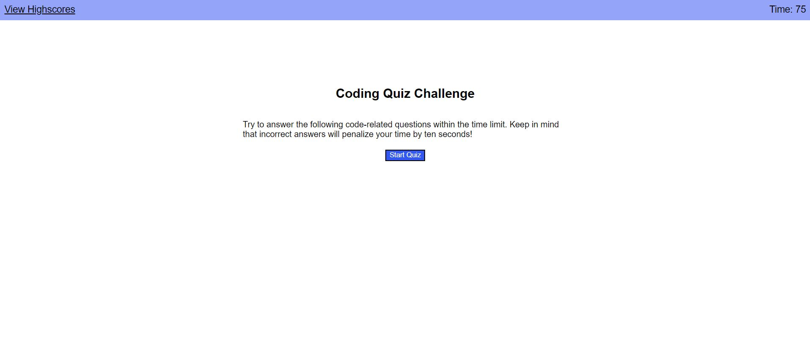

# code-quiz

## Description

The motivation of this project is to build a timed coding quiz web application that features dynamically updated HTML and CSS powered by JavaScript. This exercise is good practice for utilizing Web API and third party API such as jQuery to create and append elements. This activty uses local storage to store user values for later retrieval. These tools are important for building dynamic applications that render new pages based on user input.

Link to Website: https://seangshin.github.io/code-quiz/

## Installation

The following tools were used for the development and testing of this project. Web Browser (Google Chrome preferred) Code development IDE (Microsoft VS Code)

## Usage

Open HTML and CSS code using Code development IDE. Open HTML using Web Browser.

## Credits

Georgia Tech Coding Bootcamp instructors, TA's, and other faculty.

## License

Not applicable